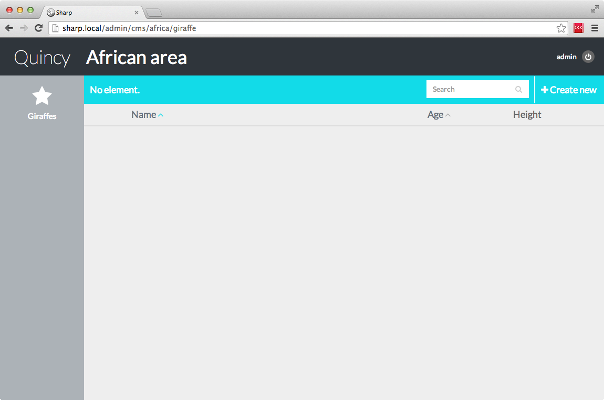
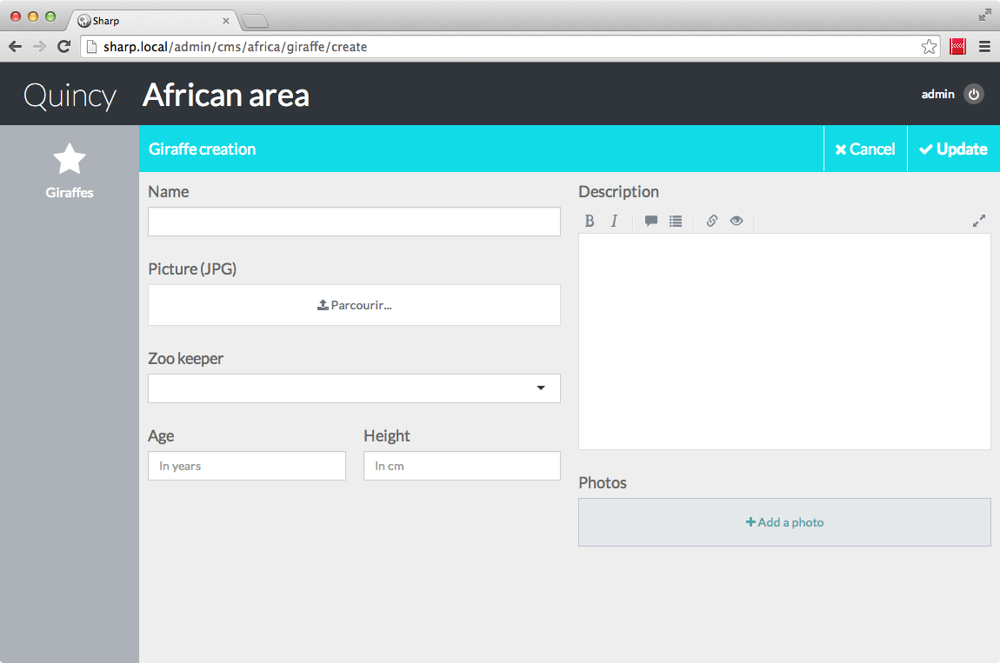

#Sharp's config file(s)

Sharp integration is divided in two parts: the coding (by extending / implementing Sharp's classes or interfaces), and the data description, done in config files. Wharp has two of them :

- a *site* config, quite simple
- and a *cms* one, which can be very long.

## The site config file
Here's a simple example, of a file stored in `app/config/packages/dvlpp/sharp/site.php`:

```
   return [
      "name" => "Quincy",
      "auth_service" => '\Quincy\Services\SharpAuth'
   ];
```

OK, that's all of it for now. Oh, and that's the long-version: auth_service isn't even required (and we'll see how it works later). So, basically, in this file you give a name to your project. Be creative.

## The cms config file
I was trying to create the longest config file ever. I think I gave up too soon, basics are here... The purpose of this file is to describe, for each *Entity*, the form fields, the list columns, and some options. Let's see an example for our giraffe:

```
return [

"africa" => [
	"label" => "African area",
	
	"entities" => [
		"giraffe" => [
			"label"   => "Giraffe",
			"icon"    => "star",
			"plural"  => "Giraffes",

			"active_state_field" => "alive",

			// List columns
			"list_template" => [
				"columns" => [
					"picture" => [
						"width" => 1,
						"renderer" => 'thumbnail:100x100'
					],
					"name" => [
						"header"   => "Name",
						"sortable" => true,
						"width" => 7
					],
					"age" => [
						"header"   => "Age",
						"sortable" => true,
						"width" => 2
					],
					"height" => [
						"header"   => "Height",
						"width" => 2,
						"renderer" => '\Quincy\Sharp\Giraffe\HeightColumnsRenderer'
					]
				],

				"paginate" => 20,
				"reorderable" => false,
				"sublist" => true,
				"searchable" => true
			],

			// Model
			"repository" => '\Quincy\Sharp\Giraffe\Repository',
			"validator" => '\Quincy\Sharp\Giraffe\Validator',

			// Fields
			"form_fields" => [
				"name" => [
					"label" => "Name",
					"type" => "text"
				],

				"picture" => [
					"label" => "Picture (JPG)",
					"type" => "file",
					"file_filter" => "jpg,jpeg",
					"file_filter_alert" => "JPG only",
					"thumbnail" => "200x100"
				],

				"zoo_id" => [
					"label" => "Zoo",
					"type" => "ref",
					"repository" => '\Quincy\Sharp\Zoo\Repository'
				],

				"desc" => [
					"label" => "Description",
					"type" => "markdown",
					"toolbar" => "BI QU LP F"
				],
				
				"age" => [
					"label" => "Age",
					"type" => "text",
					"attributes" => [
						"placeholder" => "In years"
					],
					"field_width" => 6
				],
				
				"height" => [
					"label" => "Height",
					"type" => "text",
					"attributes" => [
						"placeholder" => "In cm"
					],
					"field_width" => 6
				],

				"photos" => [
					"label" => "Photos",
					"type" => "list",
					"sortable" => true,
					"addable" => true,
					"removable" => true,
					"add_button_text" => "Add a photo",
					"item" => [
						"file" => [
							"type" => "file",
							"file_type" => "jpg,jpeg,png,gif",
							"thumbnail" => "0x100"
						],
						"legend" => [
							"type" => "markdown",
							"height" => 120,
							"toolbar" => "BIUL"
						]
					]
				]
			], // End of form fields
			
			"form_layout" => [
				"tab1" => [
					"tab" => "",
					"col1" => [
						"name",
						"picture",
						"zoo_id",
						"age",
						"height"
					],
					"col2" => [
						"desc",
						"photos"
					]
				]
			]
		]
	]
]       

```

OK. This is a lot, but the idea is to describe all the more or less static business logic. So, let's first see what's Sharp doing with this config file. We can do it by opening the browser to the address `domain.com/admin/cms/africa/giraffe`. And:



Clicking "Create new":



So what's happened? Well, with some config and a little amount of code (described in the sections )