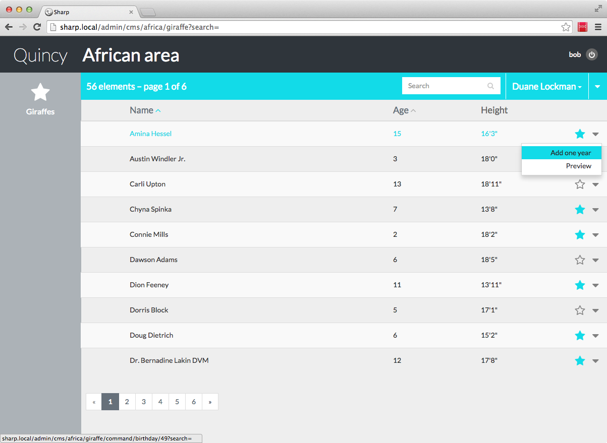

#Commands

Let's say that our zoo administrator wants to execute some specific actions like export a CSV file of a giraffe list, or quickly update an attribute right from the list view, or even have a online page preview before publishing content. Well, that why there's commands in Sharp.

1. [Command config](#config)
2. [Reload command](#reload)
3. [View command](#view)
3. [Download command](#download)

##<a name="config"></a> 1. Command config

It always start with some config:

```
return [
	"africa" => [
		"label" => "African area",

		"entities" => [
			"giraffe" => [
			
			(...)

			"commands" => [
				"list" => [
					"export" => [
						"text" => "Export (CSV)",
						"type" => "download",
						"handler" => '\Quincy\Sharp\Giraffe\ExportCsvCommand',
					]
				],
				"entity" => [
					"birthday" => [
						"text" => "Add one year",
						"type" => "reload",
						"handler" => '\Quincy\Sharp\Giraffe\BirthdayCommand'
					],
					"view" => [
						"text" => "Preview",
						"type" => "view",
						"handler" => '\Quincy\Sharp\Giraffe\PreviewCommand',
						"view" => "sharp_previews/giraffe"
					]
				]
			],
			
			(...)
		]
	]
]
```

As you can see, there's two kinds of commands: "list" and "entity". The first one is applicable of entities list, and the second one on a particular entity instance.

Next, there's 3 possible types: "download", "reload" and "view". They are explained below, but let's first start viewing this config implication on Sharp:



A new caret appeared at the end of each row, with a submenu containing all commands. The same is true on the list itself, thanks to the "Export" list command, for which the caret is in the blue list bar, on the right.


##<a name="reload"></a> 2. Reload command

Our first entity command is called "birthday", and refers to a `Quincy\Sharp\Giraffe\BirthdayCommand` command handler. Well, let's create this class and let it implement `Dvlpp\Sharp\Commands\SharpEntityCommand`.

```
<?php namespace Quincy\Sharp\Giraffe;

use Dvlpp\Sharp\Commands\SharpEntityCommand;

class BirthdayCommand implements SharpEntityCommand {

	private $repository;

	function __construct(Repository $repository)
	{
		$this->repository = $repository;
	}

	function execute($instanceId)
	{
		$giraffe = $this->repository->find($instanceId);
		$giraffe->age++;
		$giraffe->save();
	}
}
```

*Note: as always in this documentation, code is simplified... of course, the actual modification of a giraffe instance should be done in the repository, but I kept it this way for clarity.*

The `execute()` method is required, and accept the `$instanceId` (a giraffe id for us) as a parameter. All we have to do is the increment the age, and return nothing, in the command "reload" case.


##<a name="view"></a> 3. View command

The "preview" entity command we described above is a little bit different: in a "view" type, meaning that Sharp must load a view (specified in the config) with the command data in a new window. Here's the command handler `execute()` method possible code:

```
function execute($instanceId)
{
	$giraffe = $this->repository->find($instanceId);
	return compact('giraffe');
}
```

Sharp will load the `sharp_previews/giraffe` view with a `$giraffe` parameter, and open it in a new browser window / tab.


##<a name="download"></a> 4. Download command

To demonstrate the download command, let's take a list command this time, named "export". The goal is to create a CSV file of the displayed giraffe list and send it to the user.

As this refers to an entities list this time, we will implement `Dvlpp\Sharp\Commands\SharpEntitiesListCommand`:

```
<?php namespace Quincy\Sharp\Giraffe;

use Dvlpp\Sharp\Commands\SharpEntitiesListCommand;
use Dvlpp\Sharp\ListView\SharpEntitiesListParams;

class ExportCsvCommand implements SharpEntitiesListCommand {

	private $repository;

	function __construct(Repository $repository)
	{
		$this->repository = $repository;
	}

	function execute(SharpEntitiesListParams $entitiesListParams)
	{
		$query = Giraffe::with('zookeeper')
			->where("zookeeper_id", $entitiesListParams->getCurrentSublistId());

		if($entitiesListParams->getSearch())
		{
			foreach($entitiesListParams->getSearchTerms() as $term)
			{
				$query->where(function ($query) use($term) {
					$query->orWhere("name", "like", $term)
						->orWhere('desc', 'like', $term);
				});
			}
		}

		if($entitiesListParams->getSortedColumn())
		{
			$query->orderBy($entitiesListParams->getSortedColumn(), $entitiesListParams->getSortedDirection());
		}

		$giraffes =  $query->get();

		// Code omitted: generate a CSV file with $giraffes
		// ...

		return public_path("tmp/giraffes.csv");
	}
}
```

As you can see, the execute method accept a SharpEntitiesListParams parameter, valued as for the `listAll()` or `paginate()` [repository methods](entities_list.md). Of course you can call a repo method here and mutualize the code.

As expected, when the command is called, the generated csv file is downloaded.

